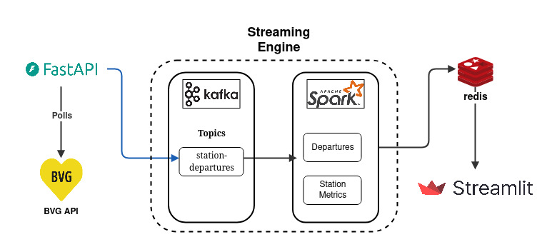

# 🚉 Berlin Transit Delay Monitoring System

[](https://kafka.apache.org/)
[](https://spark.apache.org/)
[](https://fastapi.tiangolo.com/)
[](https://redis.io/)
[](https://python.org/)
[](https://streamlit.io/)

A real-time data processing pipeline that monitors Berlin's public transport network (BVG) for delays, performance metrics, and departure analytics. The system provides live insights through an interactive dashboard showing delay patterns across major Berlin transit stations.

## 🎯 Project Overview

This system continuously monitors 10 major Berlin transit stations, processing real-time departure data through a sophisticated streaming architecture. It provides actionable insights into transit performance, delay patterns, and operational metrics through an intuitive web dashboard.

### What the Dashboard Achieves

- **Real-time Transit Monitoring**: Tracks performance across major Berlin stations, recording delays, on-time performance, and departure volumes
- **Interactive Delay Heatmap**: Visual representation of delay severity across the transit network with color-coded stations
- **Performance Analytics**: Aggregated metrics showing average delays, on-time percentages, and departure statistics

## 🏗️ System Architecture

The system implements a **Lambda Architecture (Speed Layer)** pattern optimized for real-time stream processing with the following components:

### Core Components

1. **FastAPI Async Poller** - Collects data from BVG API using async operations
2. **Apache Kafka** - Message streaming and event sourcing backbone
3. **Apache Spark Streaming** - Real-time data processing with windowed analytics
4. **Redis** - High-performance storage for processed metrics
5. **Streamlit Dashboard** - Interactive web interface for data visualization

### Architecture Diagram



### Data Flow Pipeline

```
BVG API → FastAPI Poller → Kafka → Spark Streaming → Redis → Streamlit Dashboard
     ↓           ↓           ↓           ↓           ↓           ↓
  REST API   Async HTTP   Message     Stream      Key-Value   Interactive
 (60s poll)  Rate Limit   Streaming   Processing   Storage     Dashboard
```

## 🔄 Data Flow & Processing

### 1. Data Collection (FastAPI + Async)
- **Frequency**: Every 60 seconds
- **Scope**: 10 major Berlin stations (Alexanderplatz, Hauptbahnhof, etc.)
- **Technology**: FastAPI with `httpx.AsyncClient` for non-blocking HTTP operations
- **Rate Limiting**: 0.6 seconds between requests (100 req/min compliance)
- **Error Handling**: Graceful degradation with retry logic and circuit breaker patterns

### 2. Message Streaming (Kafka)
- **Topic**: `station-departures` with 10 partitions
- **Message Format**: JSON with departure metadata, timestamps, and station info
- **Features**:
  - Event sourcing for full data replay capability
  - Fault tolerance with configurable replication
  - Ordered message delivery per partition

### 3. Stream Processing (Spark Streaming)
- **Processing Model**: Structured Streaming with micro-batches (10-second intervals)
- **Windowing**: 15-minute tumbling windows for temporal aggregations
- **Watermarking**: 10-minute delay tolerance for late-arriving data
- **Deduplication**: MD5 hash-based duplicate prevention
- **Metrics Calculated**:
  - Average and maximum delays per station
  - On-time performance percentages
  - Total departure counts and delay distributions
  - Transport mode analytics

### 4. Data Storage (Redis)
- **Departures**: Sorted sets with timestamp scoring (1-hour TTL)
- **Station Metrics**: JSON objects with windowed aggregations (2-hour TTL)
- **Performance**: Sub-millisecond read/write operations
- **Data Models**:
  ```
  departure:station:{station_id} → Sorted Set (timestamp, departure_data)
  metrics:station:{station_id}:window:{timestamp} → JSON metrics
  ```

### 5. Visualization (Streamlit)
- **Real-time Updates**: 30-second auto-refresh cycle
- **Interactive Map**: Plotly-based heatmap with delay severity color coding
- **Performance Metrics**: Live KPIs for system-wide and station-specific performance
- **Time Controls**: Configurable lookback periods with roll-up aggregations

## 🛠️ Technology Stack

### Backend Processing
- **Python 3.11+** - Core runtime environment
- **Apache Kafka** - Distributed event streaming platform
- **Apache Spark 3.4+** - Large-scale data processing engine with Structured Streaming
- **Redis** - In-memory data structure store for high-performance caching

### API & Web Services
- **FastAPI** - Modern async web framework for the data poller service
- **Streamlit** - Interactive web application framework for the dashboard
- **HTTPX** - Async HTTP client for BVG API integration

### Data Processing & Analytics
- **Pandas** - Data manipulation and analysis
- **Plotly** - Interactive visualization library
- **Pydantic** - Data validation and settings management

### Infrastructure
- **Docker & Docker Compose** - Containerized deployment
- **Poetry** - Dependency management and packaging

## ⚡ Key Features

### Real-time Processing
- **Sub-minute Latency**: End-to-end processing in under 60 seconds
- **Async Architecture**: Non-blocking I/O throughout the data pipeline
- **Scalable Design**: Horizontally scalable components with stateless processing

### Data Quality & Reliability
- **Deduplication**: Hash-based duplicate detection and removal
- **Error Handling**: Comprehensive error recovery and graceful degradation
- **Data Validation**: Pydantic-based schema validation
- **TTL Management**: Automatic data expiration prevents stale information

### Monitoring & Observability
- **Health Checks**: Built-in health endpoints for all services
- **Kafka UI**: Web-based monitoring for message streams
- **Performance Metrics**: Real-time processing statistics
- **Structured Logging**: Comprehensive logging with log levels

## 🚀 Quick Start

### Prerequisites

- **Python 3.11+**
- **Docker & Docker Compose**
- **Poetry** (for dependency management)

### Installation

1. **Clone the repository**
   ```bash
   git clone <repository-url>
   cd berlin-departure-board
   ```

2. **Install dependencies**
   ```bash
   poetry install
   ```

3. **Start the entire stack**
   ```bash
   ./start.sh
   ```

   This script will:
   - Start Docker services (Kafka, Redis, Zookeeper)
   - Create necessary Kafka topics
   - Launch the FastAPI data poller
   - Start Spark streaming processor
   - Open the Streamlit dashboard at `http://localhost:8501`

### Manual Setup (Alternative)

If you prefer manual control:

1. **Start infrastructure services**
   ```bash
   docker-compose up -d
   ```

2. **Create Kafka topic**
   ```bash
   docker exec kafka kafka-topics --bootstrap-server localhost:9092 \
     --create --topic station-departures --partitions 10 --replication-factor 1
   ```

3. **Start the data poller**
   ```bash
   poetry run python -m berlin_departure_board.poller.scheduler
   ```

4. **Start Spark processing**
   ```bash
   poetry run python -m berlin_departure_board.spark_processing.runner
   ```

5. **Launch dashboard**
   ```bash
   poetry run streamlit run berlin_departure_board/dashboard/app.py
   ```

### Stopping the System

```bash
./stop.sh
```

This will gracefully shut down all services and optionally clean up Docker volumes.

## 📊 Dashboard Features

### Interactive Delay Heatmap
- **Color-coded Stations**: Blue (on-time) to dark blue (severe delays)
- **Dynamic Sizing**: Marker size correlates with delay severity
- **Hover Details**: Station-specific metrics on mouse hover
- **Real-time Updates**: Live data refresh every 30 seconds

### Performance Metrics
- **System Overview**: Active stations, average delays, total departures
- **Station Rankings**: Best and worst performing stations
- **Time-based Controls**: Adjustable lookback periods (15-120 minutes)

### Data Tables
- **Station Details**: Sortable performance data with status indicators
- **Performance Status**: Visual indicators (🟢🟡🔴) for quick assessment
- **Export Capability**: Data download options for further analysis

## 🔧 Configuration

### Station Monitoring
The system monitors these major Berlin stations:
- Alexanderplatz, Hauptbahnhof, Friedrichstraße
- Potsdamer Platz, Zoologischer Garten, Ostbahnhof
- Gesundbrunnen, Südkreuz, Westkreuz, Lichtenberg

## 📈 Performance & Scaling

### Throughput Capacity
- **API Polling**: 100 requests/minute (BVG rate limit compliant)
- **Message Processing**: 1000+ messages/second through Kafka
- **Storage Operations**: 10,000+ operations/second via Redis
- **Dashboard Updates**: Sub-second response times

### Scaling Considerations
- **Horizontal Scaling**: Add Kafka partitions and Spark executors
- **Vertical Scaling**: Increase memory allocation for Spark processing
- **Database Scaling**: Redis clustering for larger datasets
- **Load Balancing**: Multiple poller instances for higher availability

## 🐛 Troubleshooting

### Common Issues

1. **Kafka Connection Errors**
   ```bash
   # Check Kafka container status
   docker ps | grep kafka

   # Verify topic exists
   docker exec kafka kafka-topics --bootstrap-server localhost:9092 --list
   ```

2. **Redis Connection Issues**
   ```bash
   # Test Redis connectivity
   docker exec redis redis-cli ping
   ```

3. **Port Conflicts**
   - Kafka: 9092
   - Redis: 6379
   - Streamlit: 8501
   - Kafka UI: 8080

### Logs & Monitoring
- **Application Logs**: Check container logs with `docker-compose logs`
- **Kafka UI**: Access at `http://localhost:8080` for message monitoring
- **Health Endpoints**: FastAPI health check at `http://localhost:8000/health`

## 📜 License

This project is licensed under the MIT License - see the LICENSE file for details.
---
